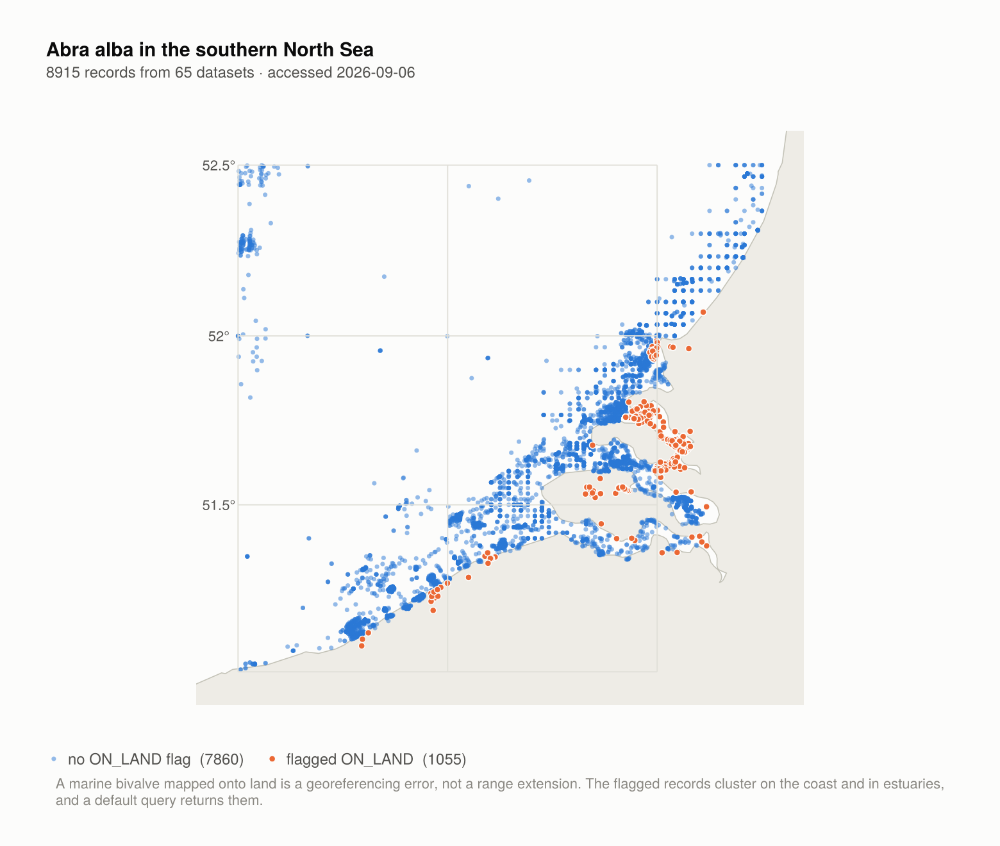
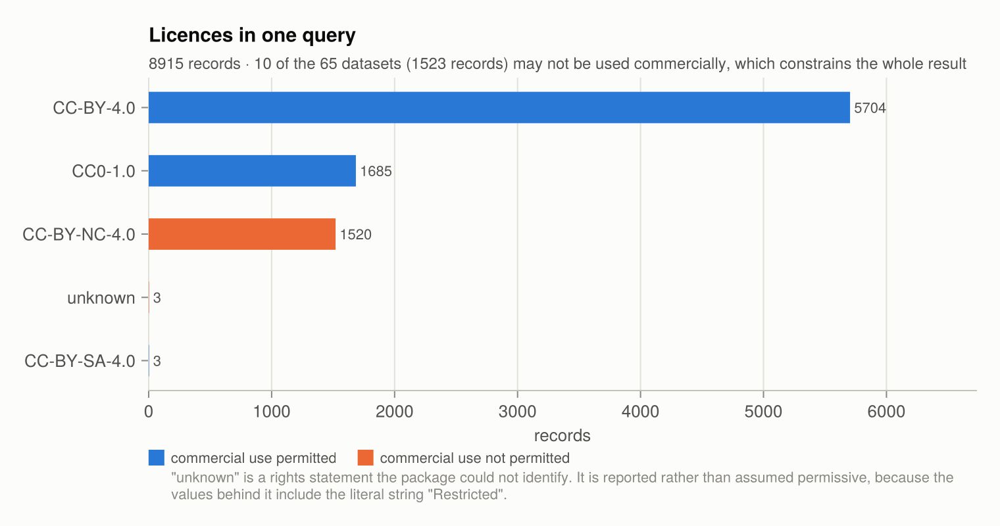

# OBIS.jl

A Julia client for OBIS, the Ocean Biodiversity Information System, a programme of the
Intergovernmental Oceanographic Commission of UNESCO.

[](https://github.com/dantebertuzzi/OBIS.jl/actions/workflows/CI.yml)
[](https://codecov.io/gh/dantebertuzzi/OBIS.jl)
[](https://julialang.org)
[](https://dantebertuzzi.github.io/OBIS.jl/dev)
[](LICENSE)

> **Not an official OBIS product.** OBIS.jl is an independent, community-maintained client.
> It is not affiliated with, endorsed by, or maintained by OBIS, the Intergovernmental
> Oceanographic Commission, or UNESCO. The name identifies the service the package connects
> to; the data, the API and the quality control pipeline are the work of OBIS and its nodes.

## Installation

```julia
using Pkg
Pkg.add("OBIS")
```

## A first query

```julia
using OBIS

recs = OBIS.occurrence("Abra alba"; limit = 500)

recs.scientificName          # a column
recs.decimalLatitude         # Float64, always
recs.flags                   # a Set{String} per record

OBIS.nrow(recs)
```

Results implement the Tables.jl interface, so they go straight into whatever you use:

```julia
using DataFrames
df = DataFrame(recs)

using CSV
CSV.write("abra_alba.csv", recs)
```

## Query, licences, citations

Data from OBIS comes with obligations. Datasets carry different licences, and any use has
to be cited with the date it was accessed. Both travel with the result.

```julia
using OBIS, Dates

# A query: one species, in the southern North Sea, over two decades.
recs = OBIS.occurrence(;
    scientificname = "Abra alba",
    geometry = "POLYGON ((2.0 52.5, 2.0 51.0, 4.5 51.0, 4.5 52.5, 2.0 52.5))",
    startdate = Date(2000, 1, 1),
    enddate   = Date(2020, 12, 31),
)                                    # 5,921 records from 43 datasets

# What may be done with these data?
OBIS.licenses(recs)
# license       datasets  records  permits_redistribution  permits_commercial_use  requires_attribution
# CC-BY-4.0           28     3875                    true                    true                  true
# CC0-1.0              8     1136                    true                    true                 false
# CC-BY-NC-4.0         6      907                    true                   false                  true
# unknown              1        3                   false                   false                  true

# Six CC BY-NC datasets make the combined result non-commercial, and one dataset's rights
# statement could not be identified at all. The summary says so before you build on it.

# How to credit them. The access date comes from the request, so it is already correct.
print(OBIS.citations(recs; format = :text))

# For a manuscript:
write("obis-references.bib", OBIS.citations(recs; format = :bibtex))

# The per-dataset breakdown, as a table.
cites = OBIS.citations(recs)
cites.dataset_id, cites.records, cites.license, cites.doi

# Wageningen Marine Research (2019). WOT-schelpdieren: Dutch national shellfish monitoring
# in the coastal zone. [Dataset] (Available: Ocean Biodiversity Information System.
# Intergovernmental Oceanographic Commission of UNESCO. https://obis.org.
# Accessed: 2026-09-06)
```

Records the default view leaves out are available too. Absence records — a species looked
for and not found — and records the quality pipeline dropped are served by the API and not
by the bulk downloads:

```julia
absences = OBIS.occurrence("Abra alba"; absence = :only)
dropped  = OBIS.occurrence("Abra alba"; dropped = :only)
```

## What the data looks like

The figures below are produced by [`examples/figures.jl`](examples/figures.jl) from live
queries; regenerate them with `julia --project=examples examples/figures.jl`. Plotting is
not part of the package — CairoMakie and GeoMakie belong to the example environment only.

**Where the records are, and which ones the pipeline flagged.** A default query returns
flagged records alongside clean ones. Here the `ON_LAND` records are not scattered at
random: they sit on the Dutch coast and in the Zeeland estuaries, which is what a
georeferencing error looks like for a marine bivalve.

<picture>
  <source media="(prefers-color-scheme: dark)" srcset="examples/figures/map-north-sea-dark.png">
  
</picture>

**Record counts measure sampling effort.** The rise through the late twentieth century is
survey programmes and digitization campaigns, not a population increase; the fall at the
right-hand end is publication lag. Neither is biology.

<picture>
  <source media="(prefers-color-scheme: dark)" srcset="examples/figures/records-per-year-dark.png">
  
</picture>

**What a result may be used for.** Licences are per dataset, so one query usually spans
several, and the most restrictive governs the whole. `OBIS.licenses(result)` reports this
before you build anything on the data.

<picture>
  <source media="(prefers-color-scheme: dark)" srcset="examples/figures/licenses-dark.png">
  
</picture>


## How it fits Julia

The package is written for the way Julia code is normally written, and the four points
below are the ones that show up in day-to-day use.

**Columns have concrete element types.** JSON has a single number type, and the encoder
drops a zero fractional part, so about 2% of `decimalLatitude` values arrive as integers.
Inferring types per value would give a `Union{Int64,Float64}` coordinate column, which
neither dispatches nor vectorizes well. Every numeric field is coerced, so
`recs.decimalLatitude isa Vector{Union{Missing,Float64}}` holds for every query, and
`Tables.schema` is known before a single row is read.

**`missing` means missing, and nothing else.** Absent values are `missing`; a column never
disappears because a query happened to return no value for it. Collection-valued columns go
further and are never `missing`: `flags` is a `Set{String}` that is empty when the quality
pipeline raised nothing, because "no flags" is a fact about the record rather than a gap in
it. So `count(fs -> "ON_LAND" in fs, recs.flags)` needs no missing-handling.

**Tables.jl is the interface, not DataFrames.** Results implement Tables.jl directly, so
the package depends on none of DataFrames, CSV, Arrow or Parquet while working with all of
them. DataFrames-specific behaviour — flattening the `extra` column, and the DataAPI
`nrow`/`ncol` generics — lives in a package extension under `ext/` that loads only if you
already have DataFrames. Installing the client pulls in HTTP, JSON3, StructTypes, Tables
and two stdlibs, and nothing else.

**Large pulls are an iterator.** `occurrence_pages` implements the iterator protocol, so it
composes with `for`, `Iterators.take`, `Iterators.filter` and everything else in Base
without materializing the query. The client is native Julia end to end; there is no foreign
runtime to install or marshal across.

## Design notes

**The schema is stable across queries.** OBIS returns only the fields a record has a value
for, so the field set differs from query to query: a sample of 2,000 records across five
taxa contained 188 distinct field names, of which 25 appeared in every record. A result
here always has the same columns in the same order, with concrete types — dates as
`DateTime`, coordinates and depths as `Float64`, quality flags as a `Set{String}`, absent
values as `missing`. Darwin Core fields outside the core schema are preserved per row in an
`extra` column, so nothing the provider supplied is lost and the main schema stays
predictable.

**Licence and citation are part of the result.** An occurrence record carries a dataset
identifier and no rights information, so the package joins the licence and citation from
the dataset and records the access date at request time. `licenses(result)` reports what
the result may be used for; `citations(result)` produces the credit its licences require,
in text or BibTeX. OBIS publishes the licence as free prose — 63 distinct strings across
the corpus — so it is normalized to an identifier, the original text is kept alongside, and
statements that cannot be identified are reported as `unknown` rather than assumed
permissive.

**Two access routes, chosen by you.** The API serves filtered queries; OBIS recommends its
bulk GeoParquet export for large volumes. A query estimated to exceed a configurable
threshold raises an error naming the alternatives instead of switching routes, because the
routes do not cover the same records: absence and dropped records exist only on the API,
and the export excludes records of insufficient quality. Silently changing route would
change the answer.

**Large queries stream and resume.** `occurrence_pages` yields one page at a time, so a
query larger than memory is still workable. Pagination is keyset on the record UUID, so the
whole of the cursor is one string: save it, and resume in another session.

**Responses can be cached for reproducibility.** An optional local cache stores the raw
response addressed by a hash of the query, with the retrieval date. OBIS ingests records
continuously, so re-running an analysis months later otherwise returns different data.

**Network use is conservative.** Requests are serial and identified by a `User-Agent`
naming the package, its version and this repository. Failures back off exponentially and
honour `Retry-After`. OBIS asks that downloads not be parallelized, and the package does
not offer it.

## Scope

The package is a client. It does not:

- perform statistical analysis, species distribution modelling, or any modelling;
- draw maps or plots;
- ship any OBIS data. OBIS records have a DOI and an access date; a frozen copy inside a
  package would break the citation it is supposed to support.

## Interpreting the results

Two points bear on any analysis, and are covered in the documentation:

- **Record counts measure sampling effort as much as biology.** A rise in records over time
  tracks survey programmes and digitization campaigns; it is not evidence that a taxon
  became more abundant. `statistics_years` shows this directly.
- **The default view is filtered.** Records with quality flags are included, records the
  pipeline dropped are not, and absence records are excluded unless asked for. Analysing
  presences alone without knowing whether absences exist gives a different answer than the
  data supports.

OBIS states the general caution itself:

> Appropriate caution is necessary in the interpretation of results derived from OBIS.
> Users must recognize that the analysis and interpretation of data require background
> knowledge and expertise about marine biodiversity (including ecosystems and taxonomy).

Print the full disclaimer with `OBIS.disclaimer()`.

## Citing OBIS data

Cite the datasets you used. `OBIS.citations(result)` builds them, with the access date
filled in. The OBIS data policy asks that any use — software applications included — be
cited, and each dataset's own licence conditions continue to apply.

Where a result draws on many datasets, the database as a whole may be cited **in addition
to**, never instead of, the individual datasets:

```julia
OBIS.obis_citation(; description = "Distribution records of Abra alba")
```

The general citation for the system:

> OBIS (YEAR) Ocean Biodiversity Information System. Intergovernmental Oceanographic
> Commission of UNESCO. https://obis.org.

See [manual.obis.org/citing.html](https://manual.obis.org/citing.html).

## Citing this package

If the package itself was useful, cite it as described in [CITATION.cff](CITATION.cff).
Citing the package does not replace citing the data.

## Acknowledgements

OBIS is built by the OBIS secretariat and its network of regional and thematic nodes, and
by the thousands of data providers who publish their observations through them. The data
this package retrieves is theirs; the quality control, taxonomy matching against the World
Register of Marine Species, and the infrastructure that serves it are their work. Thanks to
the IOC of UNESCO for sustaining the programme, and to every node listed by `OBIS.node()`.

## License

The package is released under the MIT License; see [LICENSE](LICENSE). The data it
retrieves is licensed by its providers, under the terms each result reports.
