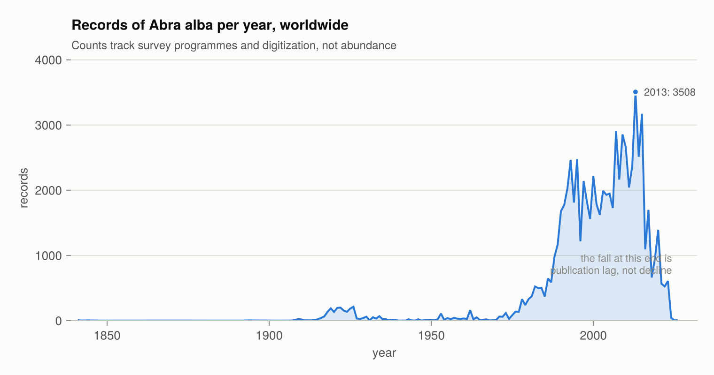

# OBIS.jl

A Julia client for OBIS, the Ocean Biodiversity Information System, a programme of the
Intergovernmental Oceanographic Commission of UNESCO — typed results with a schema that
does not change between queries, licence and citation carried on every row, and access to
the absence and dropped records the bulk downloads leave out.

!!! note "Not an official OBIS product"
    OBIS.jl is an independent, community-maintained client. It is not affiliated with,
    endorsed by, or maintained by OBIS, the Intergovernmental Oceanographic Commission, or
    UNESCO. The name identifies the service the package connects to; the data, the API and
    the quality control pipeline are the work of OBIS and its nodes.

## Installation

```julia
using Pkg
Pkg.add("OBIS")
```

## Quick start

```julia
using OBIS

recs = OBIS.occurrence("Abra alba"; limit = 500)

recs.scientificName        # a column
recs.decimalLatitude       # Float64, always
recs.flags                 # a Set{String} per record

OBIS.licenses(recs)        # may these data be redistributed?
OBIS.citations(recs)       # how to credit them, access date included
```

Results implement the Tables.jl interface, so `DataFrame(recs)`, `CSV.write("out.csv", recs)`,
Arrow and Parquet all work without the package depending on any of them.

## Functions

| Function | What it returns | Page |
| --- | --- | --- |
| [`occurrence`](@ref OBIS.occurrence) | Occurrence records, as a typed table | [Getting started](getting-started.md) |
| [`occurrence_pages`](@ref OBIS.occurrence_pages) | Lazy, resumable pages of the same | [Large queries](large-queries.md) |
| [`occurrence_by_id`](@ref OBIS.occurrence_by_id) | One record, by OBIS record UUID | [Getting started](getting-started.md) |
| [`checklist`](@ref OBIS.checklist) | Which taxa occur in a selection | [Getting started](getting-started.md) |
| [`taxon`](@ref OBIS.taxon) | A WoRMS taxon, by AphiaID or exact name | [Getting started](getting-started.md) |
| [`dataset`](@ref OBIS.dataset) | Dataset metadata, including the rights statement | [Licensing and citation](licensing.md) |
| [`node`](@ref OBIS.node), [`institute`](@ref OBIS.institute), [`area`](@ref OBIS.area), [`country`](@ref OBIS.country) | The identifiers the filters accept | [Getting started](getting-started.md) |
| [`statistics`](@ref OBIS.statistics) | Counts for a query, without retrieving records | [Interpreting OBIS data](interpreting.md) |
| [`statistics_years`](@ref OBIS.statistics_years) | Records per year | [Interpreting OBIS data](interpreting.md) |
| [`statistics_qc`](@ref OBIS.statistics_qc) | Missing and invalid fields, on-land, non-marine | [Interpreting OBIS data](interpreting.md) |
| [`facet`](@ref OBIS.facet) | Counts grouped by a field | [Interpreting OBIS data](interpreting.md) |
| [`licenses`](@ref OBIS.licenses) | What a result may be used for | [Licensing and citation](licensing.md) |
| [`citations`](@ref OBIS.citations) | The credit a result requires, as a table, text or BibTeX | [Licensing and citation](licensing.md) |
| [`estimate_size`](@ref OBIS.estimate_size) | How many records a query would return | [Large queries](large-queries.md) |
| [`download_exports`](@ref OBIS.download_exports) | The bulk GeoParquet route | [Large queries](large-queries.md) |
| [`QueryCache`](@ref OBIS.QueryCache) | Reproducible re-runs against cached responses | [Reproducibility](reproducibility.md) |
| [`configure!`](@ref OBIS.configure!) | Page size, pacing, retries, caching | [Getting started](getting-started.md) |

A full session — retrieve, map, group, pivot and test a relationship — is in
[Worked example: killer whales](worked-example.md).

Full docstrings are in the [Public API](api.md) reference. Functions the package uses
internally, and that the schema is built from, are in [Internals](internals.md).

## What the package guarantees

**A stable, typed schema.** OBIS returns only the fields a record has a value for, so the
field set differs from query to query. A result here always has the same columns in the
same order, with concrete types and `missing` for absent values. Darwin Core fields outside
the core schema are preserved per row in an `extra` column.

**Rights that travel with the data.** Every occurrence row carries the licence and citation
of its dataset, and the result records the date it was retrieved — which the OBIS citation
format requires and nothing in the data supplies.

**Access to what the downloads omit.** Absence records and records dropped by the quality
pipeline are served by the API and not by the Mapper downloads.

**A choice between access routes.** A query too large for the API raises an error naming
the alternatives rather than switching routes silently, because the routes do not cover the
same records.

## Read this before analysing anything

Record counts measure sampling effort as much as biology, and the default view of OBIS is
filtered in two directions. [Interpreting OBIS data](interpreting.md) covers the four ways
a correct query becomes a wrong conclusion.

```@raw html
<picture>
  <source media="(prefers-color-scheme: dark)" srcset="assets/records-per-year-dark.png">
  
</picture>
```

## How this manual was checked

Every number, field name, error message and API behaviour stated here was verified against
the live OBIS API rather than taken from documentation. Where a statement rests on
observation rather than on something OBIS publishes, the text says so.

Three mechanisms keep it that way:

- The examples that produce output were executed, and their output pasted back rather than
  written by hand.
- Docstring examples marked `jldoctest` are executed on every documentation build; a
  changed return value fails the build.
- A separate [integration suite](https://github.com/dantebertuzzi/OBIS.jl/blob/main/test/integration/runtests.jl)
  runs weekly against the live API and checks the assumptions this manual is built on: that
  timestamps are still milliseconds, that quality flags are still matched case-sensitively,
  that `/statistics` still agrees with `/occurrence` filter for filter, and that the
  endpoints the package relies on still exist.

The figures come from [`examples/figures.jl`](https://github.com/dantebertuzzi/OBIS.jl/blob/main/examples/figures.jl)
and [`examples/orcas.jl`](https://github.com/dantebertuzzi/OBIS.jl/blob/main/examples/orcas.jl),
which query the API when they run. Counts in the figures move as OBIS ingests data.

## Sources

This manual describes the package. For the service and the data behind it:

| Source | What it covers |
| --- | --- |
| [api.obis.org](https://api.obis.org/) | The API specification (`obis_v3.yml`) |
| [manual.obis.org/access.html](https://manual.obis.org/access.html) | How OBIS data can be accessed, and what each route includes |
| [manual.obis.org/policy.html](https://manual.obis.org/policy.html) | The data policy: licences, conditions of use, the disclaimer |
| [manual.obis.org/citing.html](https://manual.obis.org/citing.html) | Citation formats |
| [manual.obis.org/dataquality.html](https://manual.obis.org/dataquality.html) | Quality flags and the QC pipeline |
| [github.com/iobis/obis-qc](https://github.com/iobis/obis-qc) | Each quality check and the flag it raises |
| [github.com/iobis/obis-open-data](https://github.com/iobis/obis-open-data) | The bulk GeoParquet export on AWS |
| [dwc.tdwg.org/terms](https://dwc.tdwg.org/terms/) | The Darwin Core standard |

The repository also carries [`NOTES.md`](https://github.com/dantebertuzzi/OBIS.jl/blob/main/NOTES.md),
the research notes the package was built from: the endpoint and parameter inventory, the
response shapes, the pagination and error semantics, and which statements are documented
versus observed.

## Scope

The package is a client. It does not model, plot, or ship data. Analysis belongs in
packages built for it; OBIS records have a DOI and an access date, and freezing a copy
inside a package would break the citation it exists to support.

## How to cite

Cite the **datasets you used** — `OBIS.citations(result)` builds those, with the access
date filled in. See [Licensing and citation](licensing.md). Citing the package does not
replace citing the data.

For the package itself, the repository ships a
[`CITATION.cff`](https://github.com/dantebertuzzi/OBIS.jl/blob/main/CITATION.cff), which
GitHub's "Cite this repository" button reads, and a
[`CITATION.bib`](https://github.com/dantebertuzzi/OBIS.jl/blob/main/CITATION.bib):

```bibtex
@software{bertuzzi_obis_jl_2026,
  author  = {Bertuzzi, Dante},
  title   = {{OBIS.jl}: a {Julia} client for the {Ocean} {Biodiversity}
             {Information} {System}},
  year    = {2026},
  version = {0.1.0},
  url     = {https://github.com/dantebertuzzi/OBIS.jl},
  note    = {Julia package}
}
```

Cite the version you actually ran: what the package returns depends on both its own release
and the state of OBIS on the day you queried it, and the access date on your data citations
records the second half of that.
